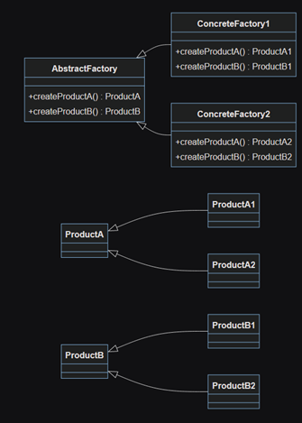
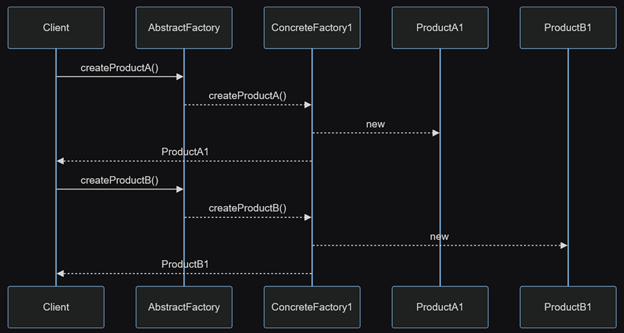
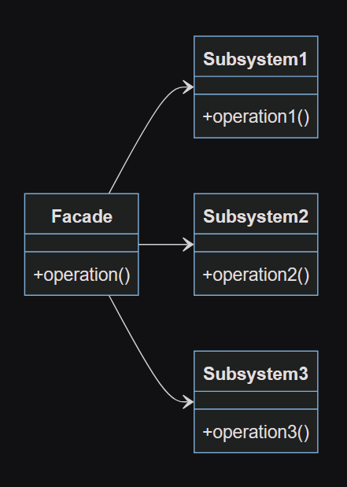
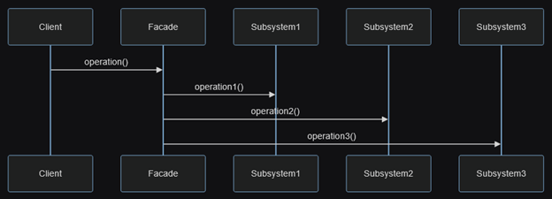
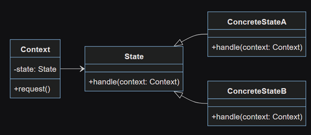
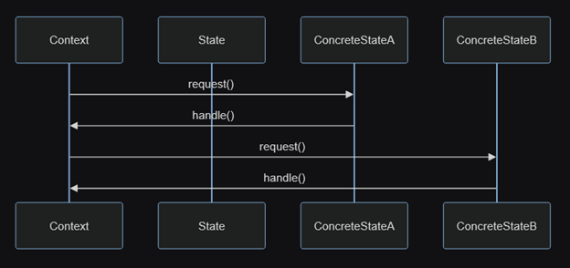
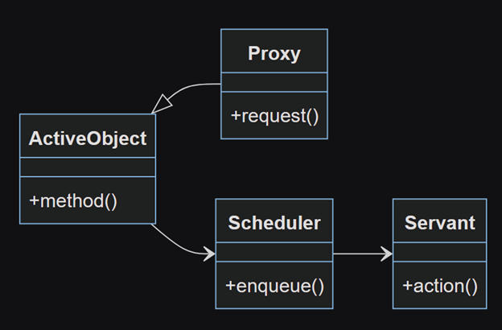
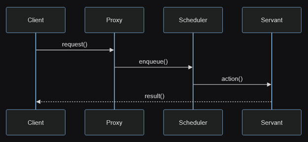

# Design Patterns

## Abstract Factory
### Опис
Абстрактна фабрика (abstract factory) — це породжуючий патерн проектування, який вирішує проблему створення цілих сімейств пов’язаних продуктів, без прив’язки коду до конкретних класів продуктів.
### UML Діаграми
#### Static Model

#### Dynamic Model

## Facade
### Опис
Фасад (facade) — це структурний патерн проектування, який надає простий інтерфейс до складної системи класів, бібліотеки або фреймворку.
### UML Діаграми
#### Static Model

#### Dynamic Model

## State
### Опис
Стан (state) — це поведінковий патерн, що дозволяє динамічно змінювати поведінку об’єкта при зміні його стану.
### UML Діаграми
#### Static Model

#### Dynamic Model

## Active Object
### Опис
Активний об’єкт (active object) - це шаблон проектування, який дозволяє розділити виконання запитів від їх обробки. Основна ідея полягає в тому, що запити представляються як об’єкти, які можуть бути виконані асинхронно.
### UML Діаграми
#### Static Model

#### Dynamic Model

